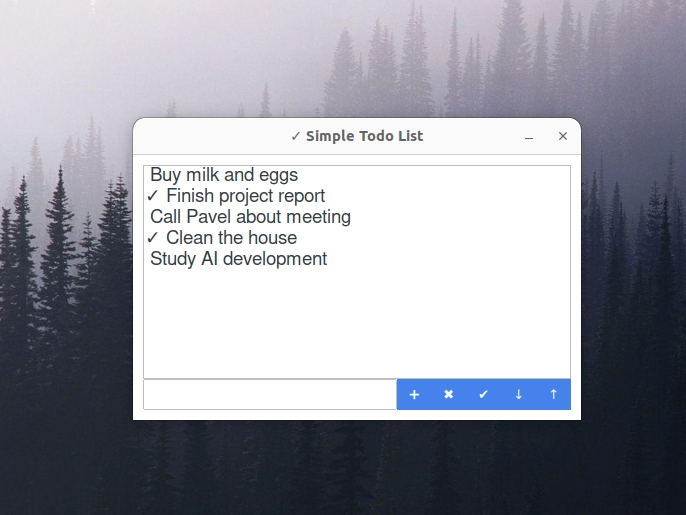

### Introducing the Simplest, Most Powerful Todo List App You'll Ever Use

Let's face it: most todo list apps are a joke. They're cluttered, confusing, and only serve to make you feel more anxious and overwhelmed.

But what if I told you there's a better way? What if I told you that my Simple Todo List App is the kick in the pants you need to finally get your life together?

This app isn't for the faint of heart. It's for people who are tired of making excuses, tired of procrastinating, and tired of feeling like they're stuck in a rut.

With my app, you'll be forced to confront the reality of your own productivity (or lack thereof). You'll be forced to prioritize your tasks, to focus on what really matters, and to stop wasting time on meaningless crap.

And you know what? It's going to hurt. It's going to be uncomfortable. But it's also going to be liberating.

**Features:**

* A simple, no-BS interface that won't let you hide from your responsibilities
* A task management system that will keep you on track and focused
* Automatic saving, so you can't even pretend like you didn't mean to do something
* And a whole lot of tough love, because let's face it, you need it

**Stop Whining and Start Doing**

If you're tired of feeling like a hot mess, if you're tired of feeling like you're not living up to your potential, then it's time to take action. Download my Simple Todo List App now and start building the life you've always wanted.
